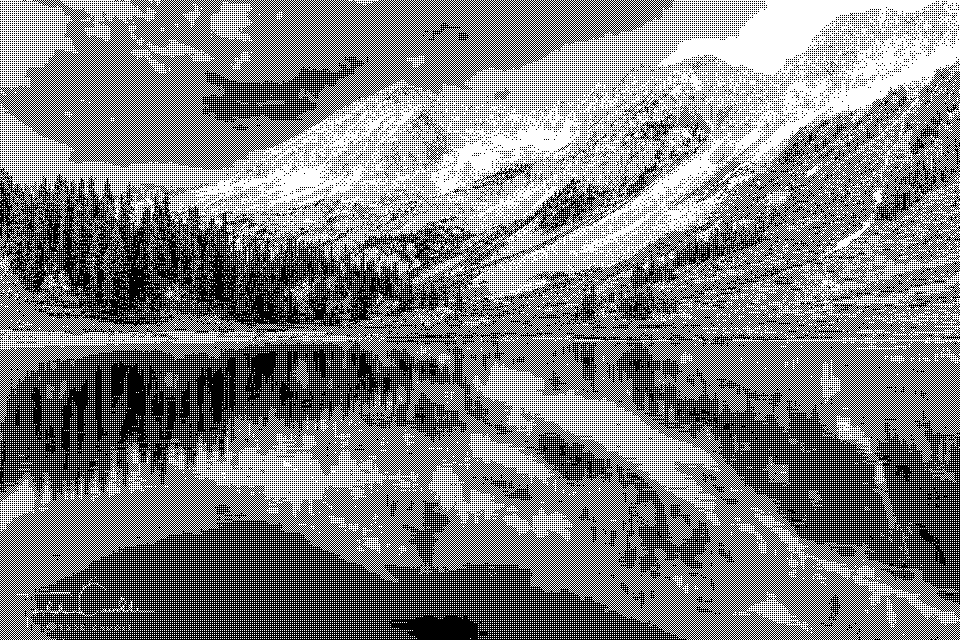
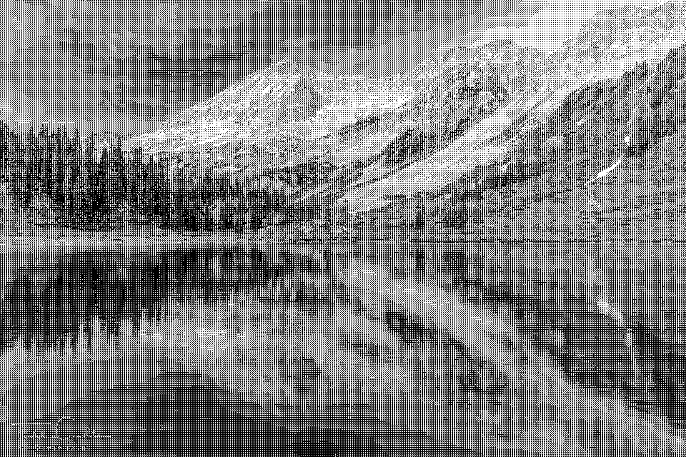
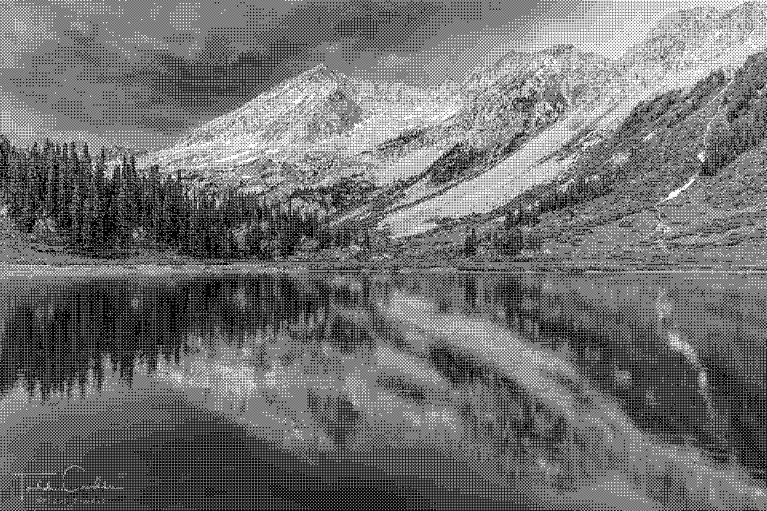
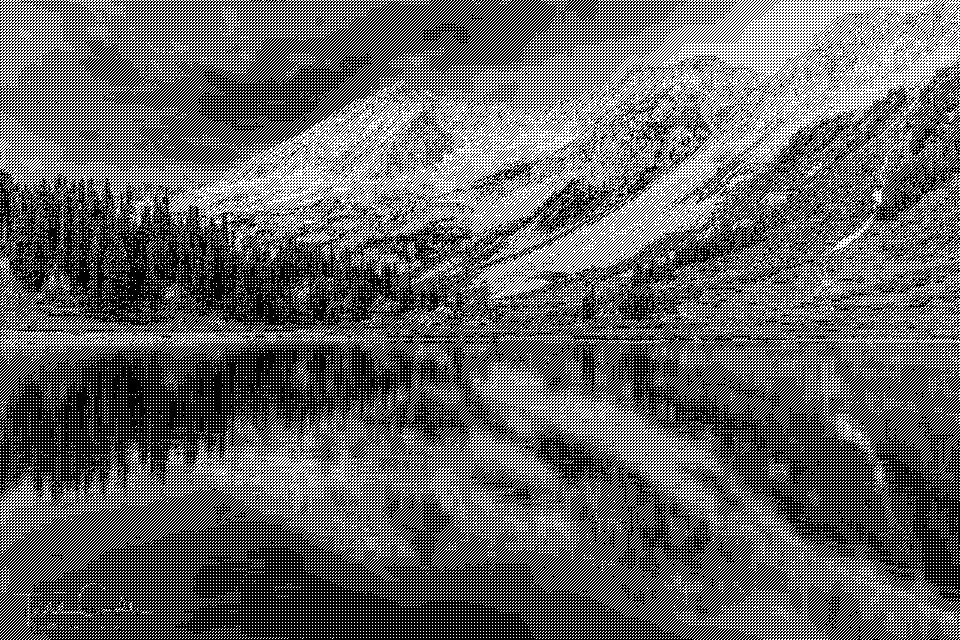
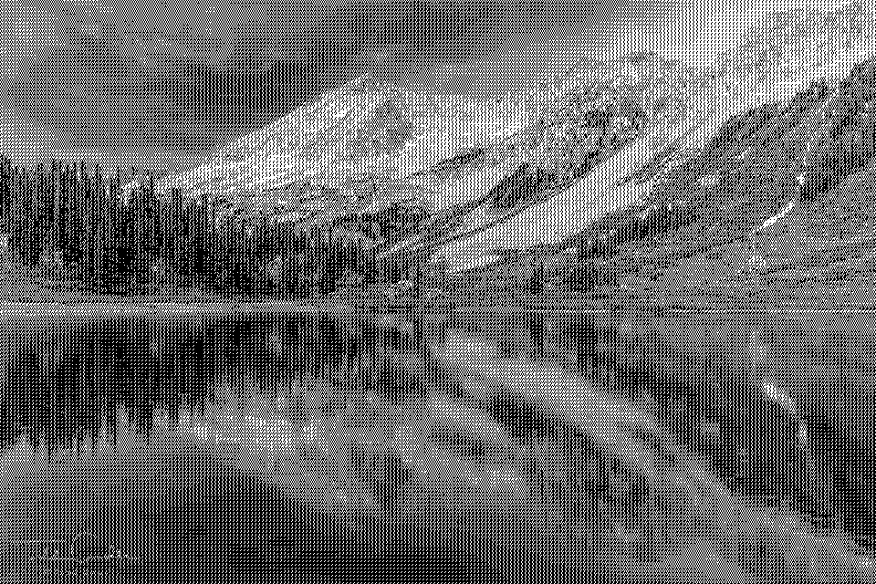
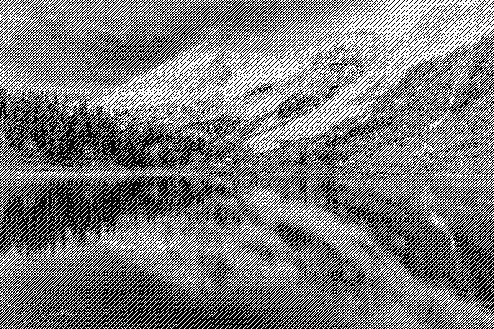
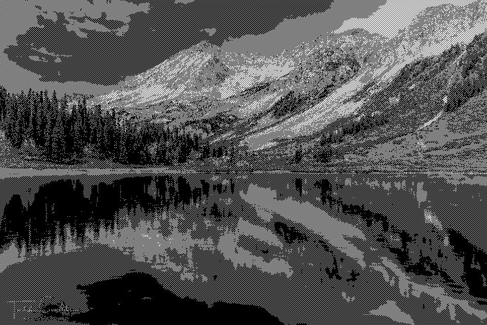
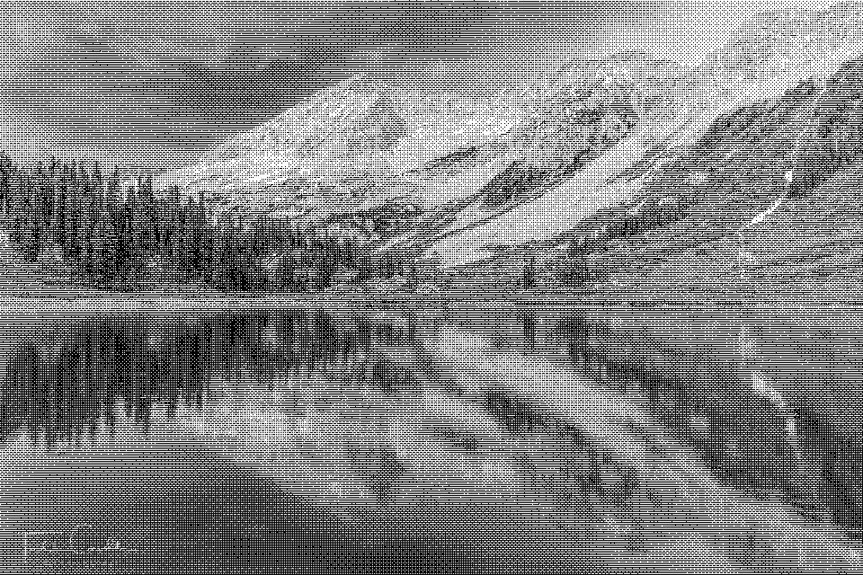

# Ordered Dithering
Command line utility to create 1-bit images featuring five different forms of ordered dithering: `Bayer`, `Forced Field`, `Magic Square`, `Shidoku`, and `Void-and-Cluster`.

To compile: ` gcc -w -framework Foundation -framework AppKit -framework QuartzCore ordered_dither.m -o ordered_dither`

To run: `./ordered_dither --dither <dither name> --size <matrix size> <original_image_file>`

Example: `./ordered_dither --dither void --size 32 Beartooth_pass.jpg`

**Original color photo of Geneva Lake, Colorado**  
Original photo by Todd Caudle &copy; [Skyline Press](https://www.skylinepress.com/product/colorado-wall-calendar/).  

## Bayer

The granddaddy of ordered dithering matrices, based on the paper [An optimum method for two-level rendition of continuous-tone pictures](https://web.archive.org/web/20130512190753/http://white.stanford.edu/~brian/psy221/reader/Bayer.1973.pdf) (1973) by Bryce Bayer.  When one thinks of ordered dithering, this is the typical algorithm which creates a distinctive crosshatch pattern.

**2x2**  

**3x3**  

**4x4**  

**8x8**  

**16x16**  

**32x32**  

## Forced Field (Forced Random Dithering)

Based on the paper [Forced Random Dithering: Improved Threshold Matrices For Ordered Dithering](https://www.academia.edu/17104333/Forced_random_dithering_improved_threshold_matrices_for_ordered_dithering) and Chapter  VI.1 from <u>Graphics Gems V</u> by Werner Purgathofer, Robert F. Tobler, Manfred Geiler.

**8x8**  

**16x16**  

## Magic Square

A [magic square](https://www.dcode.fr/magic-square) is a matrix where each row and column adds up to the same number.

**3x3**  

**4x4**  

**5x5**  

## Shidoku

A portmanteau of "shi" (the Japanese word for "four") and "sudoku", which creates a 4x4 matrix where each row and column contains the numbers 1 through 4.

**4x4**  

## Void-and-Cluster

Method based on Robert Ulichney's paper [The void-and-cluster method for dither array generation](http://cv.ulichney.com/papers/1993-void-cluster.pdf) (1993).

**8x8**  

**16x16**  

**32x32**  

**64x64**  
